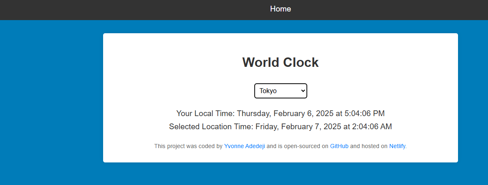

# world-clock-project

## 📌 Description
The World Clock is a web application that allows users to view the current time in multiple cities around the world. Users can select a city from a dropdown menu, and the application will display the local time in their own location, as well as the time in the selected city. The project provides an interactive and user-friendly interface for keeping track of time across different time zones.

## 🛠 Prerequisites
N/A

## 📋 Criteria
* The application should display the local time for the user.
* The application should allow users to select from a list of major cities around the world.
* The selected city's time should be displayed dynamically based on the selected location.
* The project should be responsive and usable across different screen sizes.

 ## 💻 Technologies Used
The application is built with the following technologies:
* HTML
* CSS
* JavaScript

## 🚀 Installation
No installation is required to use the app. It is hosted online and can be accessed via a web browser.

## 📚 Usage
1. Open the app in your browser.
2. Select a location from the dropdown menu.
3. The local time (based on your current timezone) and the selected location's time will be displayed.

## 🔗 Live Demo & Repository
Application can be viewed here: 
* [Live](https://ya-world-clock-project.netlify.app/)

* [Repository](https://github.com/yvonnesarah/world-clock-project)

## 🖼 Screenshot
Below is a preview of World Clock:

## 👥 Credit
N/A

## 📜 License
This project is open-source. For licensing details, please refer to the LICENSE file in the repository.

## 📬 Contact
You can reach me at 📧 yvonneadedeji.sarah@gmail.com.
